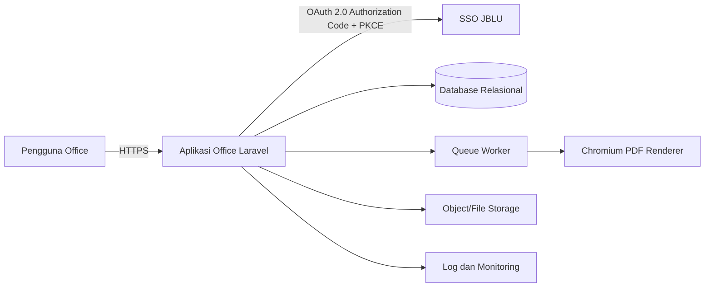
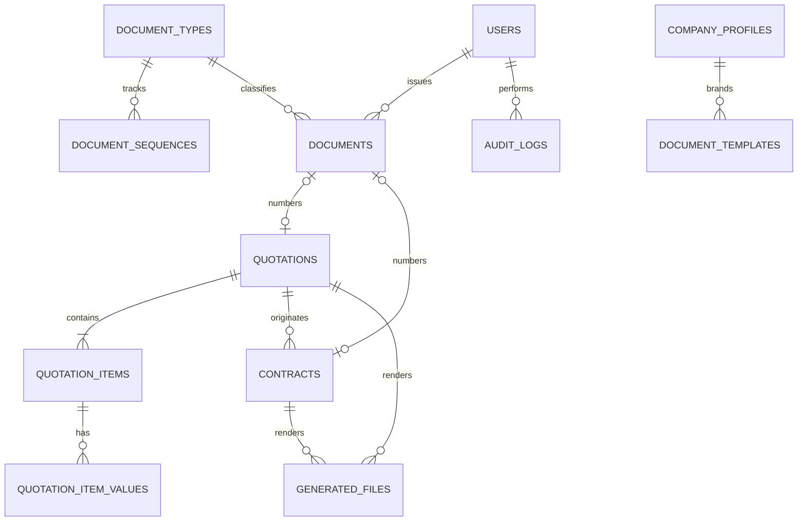
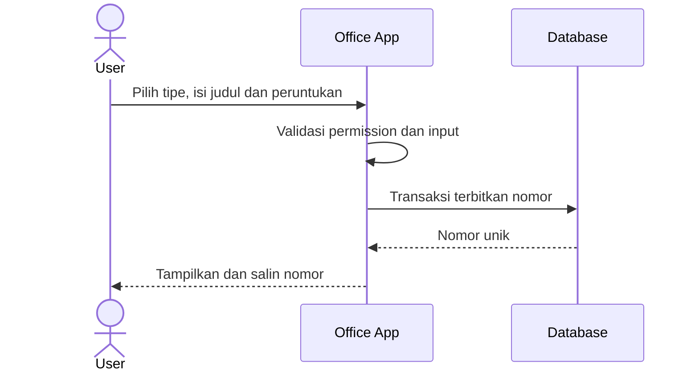
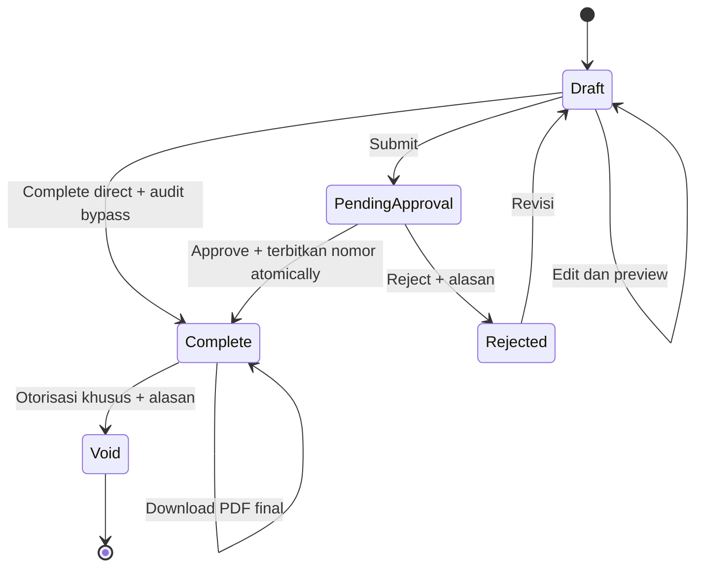
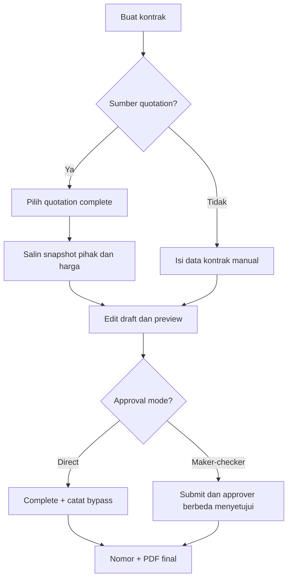

# Arsitektur dan Fase Pengembangan Aplikasi Office

## 1. Tujuan dokumen

Dokumen ini menjadi sumber utama untuk membangun Aplikasi Office PT Jayabaru Logistik Utama secara bertahap. Ruang lingkup versi pertama:

- pengguna masuk menggunakan akun SSO perusahaan;
- pengguna berwenang dapat mengelola tipe dan format nomor dokumen;
- nomor setiap tipe dokumen berurutan dan otomatis kembali ke awal pada tahun baru;
- pengguna dapat menerbitkan nomor surat dengan mencatat judul dan peruntukannya;
- pengguna dapat membuat, menyelesaikan, dan mencetak quotation;
- nomor quotation baru terbit saat quotation dinyatakan complete;
- pengguna dapat membuat kontrak dari quotation atau secara mandiri;
- quotation dan kontrak dapat dicetak sebagai PDF.

Dokumen ini juga merupakan checklist pengembangan. Sebuah fase hanya boleh ditandai selesai setelah seluruh acceptance criteria fase tersebut lulus.

## 2. Kondisi awal dan keputusan arsitektur

Repository saat ini berupa Laravel 12/PHP 8.2 dengan struktur aplikasi dasar dan belum memiliki domain Office. Arsitektur yang dipilih adalah **modular monolith**: satu aplikasi Laravel dan satu database relasional, tetapi kode dipisahkan menurut domain. Pilihan ini cukup sederhana untuk dioperasikan, tetap aman untuk transaksi penomoran, dan dapat dipecah menjadi service terpisah bila skala masa depan membutuhkannya.

### 2.1 Stack yang direkomendasikan

| Area | Pilihan | Alasan |
|---|---|---|
| Backend | Laravel 12, PHP 8.2+ | Sesuai repository dan mendukung transaksi, policy, queue, serta testing |
| Database | PostgreSQL 16+ | Sumber kebenaran dev/staging/production; mendukung constraint, transaksi, dan row locking untuk sequence |
| UI | Blade + Tabler + Alpine.js melalui Vite | Memanfaatkan layout yang sudah ada, server-rendered, dan cukup dinamis tanpa kompleksitas SPA |
| SSO | `league/oauth2-client` GenericProvider + adapter profile JBLU | Authorization Code + PKCE S256 terhadap endpoint eksplisit SSO internal |
| PDF | `spatie/laravel-pdf` v2 dengan Chrome driver | Modern CSS tanpa Node/Puppeteer pada server; spike A4 dengan logo/tabel berhasil |
| File storage | Laravel private local disk | PDF final tidak public; backup wajib. S3-compatible menjadi jalur scale-out |
| Queue | Laravel database queue, queue khusus `pdf` | Cukup untuk skala awal dan migrations sudah tersedia; Redis menjadi jalur scale-out |
| Observability | Structured log + audit log + health check | Investigasi penerbitan nomor dan kegagalan PDF |

Keputusan serta bukti spike dicatat pada [`OFF-0005`](docs/decisions/OFF-0005-TECHNICAL-STACK-SPIKE.md). Domain tidak boleh terikat pada package: gunakan interface `IdentityProvider` dan `PdfRenderer`, Laravel filesystem contract, serta queued job agar implementation driver dapat diganti.

## 3. Konteks sistem



### 3.1 Batas tanggung jawab

- SSO mengautentikasi identitas. Aplikasi Office tetap menentukan status aktif dan hak akses lokal.
- Office menggunakan endpoint SSO eksplisit untuk authorize, token, profile, dan revoke. Discovery document, JWKS, `id_token`, dan RP-initiated logout belum tersedia pada SSO saat keputusan `OFF-0001` dibuat.
- Database menjadi sumber kebenaran nomor dan status dokumen.
- File PDF final adalah representasi immutable dari data saat diterbitkan, bukan sumber kebenaran domain.
- Browser hanya mengirim intent. Penerbitan nomor, transisi status, dan otorisasi selalu divalidasi server.

## 4. Modul aplikasi

Struktur berikut adalah batas logis; implementasinya dapat menggunakan `app/Domain/*` atau struktur Laravel konvensional selama dependency antarmodul tetap satu arah.

1. **Identity & Access**
   - callback SSO, provisioning user, session, role, permission, dan policy.
2. **Document Registry**
   - tipe dokumen, pola nomor, sequence tahunan, penerbitan nomor, dan register dokumen.
3. **Quotation**
   - draft, item tarif, terms, completion, preview, dan PDF final.
4. **Contract**
   - draft mandiri atau dari quotation, isi/pasal, penerbitan, dan PDF final.
5. **Template & PDF**
   - identitas perusahaan, template versi tertentu, render, snapshot, dan download.
6. **Audit & Operations**
   - audit trail, log, health check, backup, retention, dan operational runbook.

## 5. Peran dan otorisasi

| Peran | Tanggung jawab utama |
|---|---|
| `system-admin` | Kelola user lokal, role, permission, konfigurasi, dan seluruh domain; larangan self-approval berlaku ketika mode maker-checker aktif |
| `document-admin` | Kelola tipe, pattern, template, dan konfigurasi approval dokumen |
| `document-officer` | Terbitkan serta melihat nomor surat umum |
| `quotation-maker` | Membuat, mengubah, preview, dan mengajukan quotation draft |
| `quotation-approver` | Menyetujui/menolak quotation; approval menerbitkan nomor dan mengubah status menjadi complete |
| `contract-maker` | Membuat, mengubah, preview, dan mengajukan kontrak draft |
| `contract-approver` | Menyetujui/menolak kontrak; approval menerbitkan nomor dan mengubah status menjadi complete |
| `auditor` | Read-only seluruh register, dokumen, PDF final, dan audit log |

User dapat memiliki lebih dari satu role. Permission disimpan lokal dan tidak diambil langsung dari claim SSO. Workflow maker-checker tetap tersedia untuk quotation dan kontrak, tetapi konfigurasi awal memakai mode `direct` agar maker dapat menyelesaikan dokumen sendiri selama struktur organisasi masih kecil. Bypass harus eksplisit, berpermission, dan diaudit. Ketika mode diubah ke `maker_checker`, creator/submitter tidak boleh menjadi approver, termasuk bila user juga `system-admin`. Matriks permission dan aturan transisi lengkap ditetapkan dalam keputusan [`OFF-0003`](docs/decisions/OFF-0003-ACCESS-AND-APPROVAL.md).

## 6. Model domain dan data

Gunakan primary key UUID/ULID secara konsisten. PHP/Laravel, database, queue, scheduler, dan log menggunakan UTC. Timestamp disimpan sebagai PostgreSQL `timestamptz`; waktu bisnis dan tampilan menggunakan IANA timezone `Asia/Jakarta`. Nilai uang disimpan sebagai `decimal`, tidak menggunakan floating point. Kebijakan waktu, retensi, backup, dan environment ditetapkan dalam keputusan [`OFF-0006`](docs/decisions/OFF-0006-OPERATIONS-AND-ENVIRONMENTS.md).



### 6.1 Identity

#### `users`

- `id`, `sso_subject`, `sso_issuer`, `email`, `name`;
- `is_active`, `last_login_at`, timestamps;
- unique `(sso_issuer, sso_subject)`;
- email bukan identifier utama karena dapat berubah.

Role/permission menggunakan tabel package yang dipilih atau tabel `roles`, `permissions`, dan pivot. Tidak menyediakan password lokal pada production kecuali ada kebutuhan break-glass yang diaudit.

### 6.2 Document Registry

#### `document_types`

- `id`, `code` (unique), `name`;
- `number_pattern`, contoh `QT-JBLU-{YYYY}{MM}{SEQ:4}` atau `PREFIX1-PREFIX2-{SEQ:4}`;
- `reset_period` untuk versi pertama bernilai `yearly`;
- `approval_mode`: `direct` atau `maker_checker`;
- `is_active`, timestamps.

Format terdiri dari teks literal bebas yang tervalidasi dan token allowlist `{YYYY}`, `{YY}`, `{MM}`, `{MONTH_ROMAN}`, serta `{SEQ:n}`. Prefix/suffix tetap ditulis langsung sebagai literal di dalam pola sehingga satu tipe dapat mempunyai lebih dari satu prefix. Pola wajib mempunyai tepat satu token sequence, tetapi token tahun bersifat opsional karena reset tahunan merupakan aturan internal sequence, bukan keharusan tampilan nomor. UI menggunakan segment builder dan preview agar administrator tidak perlu menulis ekspresi bebas. Perubahan pola hanya berlaku untuk penerbitan berikutnya dan tidak mengubah nomor lama.

#### `document_sequences`

- `id`, `document_type_id`, `period_year`, `last_value`, timestamps;
- unique `(document_type_id, period_year)`.

#### `documents`

- `id`, `document_type_id`, `sequence_value`, `period_year`;
- `number` (display number, tidak selalu unik lintas tahun/tipe), `title`, `purpose`;
- `source_type`, `source_id` nullable untuk quotation/contract;
- `issued_at`, `issued_by`, `voided_at`, `voided_by`, `void_reason`, timestamps;
- unique `(document_type_id, period_year, sequence_value)`;
- unique `(document_type_id, period_year, number)`;
- unique `(source_type, source_id)` untuk mencegah satu entity memperoleh dua nomor.

`number` tidak dibuat unique secara global karena pola tanpa token tahun, misalnya `PREFIX1-PREFIX2-{SEQ:4}`, secara sah menghasilkan display number yang sama setelah reset pada tahun berikutnya. Identitas register tetap UUID dokumen; pencarian nomor harus dapat difilter dengan tipe dan tahun.

Nomor yang sudah terbit tidak dihapus dan tidak dipakai ulang. Kesalahan administratif menggunakan aksi **void** dengan alasan; jejak nomor tetap terlihat di register.

### 6.3 Quotation

#### `quotations`

- `id`, `document_id` nullable dan unique, `created_by`, `template_id`;
- `status`: `draft`, `pending_approval`, `rejected`, `complete`, `void`;
- `approval_mode` snapshot: `direct` atau `maker_checker`;
- `quotation_date`, `subject`;
- customer snapshot: `customer_name`, `customer_address`, `attention_name`, `attention_role`;
- sender snapshot: `sender_name`, `sender_title`;
- `item_schema` JSON untuk snapshot definisi key, label, urutan, grouping, tipe data, dan format kolom;
- `currency` (default `IDR`), `intro_text`, `closing_text`;
- `submitted_at`, `submitted_by`, `approved_at`, `approved_by`, `rejected_at`, `rejected_by`, `rejection_reason`;
- `approval_bypassed_at`, `approval_bypassed_by`, `approval_bypass_reason` nullable untuk mode `direct`;
- `completed_at`, `completed_by`, `lock_version`, timestamps.

#### `quotation_items`

- `id`, `quotation_id`, `position`, timestamps;
- unique `(quotation_id, position)`.

#### `quotation_item_values`

- `id`, `quotation_item_id`, `key`, `value`, `value_type`, `position`, timestamps;
- `key` adalah identifier stabil, contoh `description`, `rate_20`, `rate_40`, `note`, `qty`, atau `unit_price`;
- `value` menyimpan nilai sebagai string agar format data fleksibel dan nilai desimal tidak mengalami pembulatan floating point;
- `value_type`: `text`, `decimal`, `integer`, `date`, `boolean`, atau `currency` untuk validasi dan formatting;
- unique `(quotation_item_id, key)` dan unique `(quotation_item_id, position)`.

Struktur item quotation bersifat general key-value. Kolom `rate_20` dan `rate_40` bukan kolom database tetap; keduanya hanya contoh key yang digunakan oleh template quotation container. Definisi kolom, label, urutan, tipe data, lebar, dan grouping header disimpan pada konfigurasi versi `document_templates.settings`. Saat quotation dibuat, definisi tersebut disalin sebagai snapshot konfigurasi quotation agar perubahan template berikutnya tidak mengubah draft atau PDF lama.

Contoh satu item untuk template container:

```json
{
  "description": { "type": "text", "value": "Storage / day" },
  "rate_20": { "type": "currency", "value": "35000" },
  "rate_40": { "type": "currency", "value": "45000" },
  "note": { "type": "text", "value": "Free storage 3 days" }
}
```

Template lain dapat memakai key berbeda tanpa migration database, misalnya `service`, `qty`, `unit`, `unit_price`, dan `subtotal`. Key wajib mengikuti pola `snake_case`, tidak boleh duplikat dalam satu item, dan harus cocok dengan definisi kolom template quotation tersebut.

#### `quotation_terms`

- `id`, `quotation_id`, `position`, `content`, timestamps.

Terms dipisahkan agar urutan bullet stabil dan tidak bergantung pada parsing rich text.

### 6.4 Contract

#### `contracts`

- `id`, `document_id` nullable dan unique;
- `source_quotation_id` nullable;
- `status`: `draft`, `pending_approval`, `rejected`, `complete`, `active`, `expired`, `void`;
- `approval_mode` snapshot: `direct` atau `maker_checker`;
- nomor/tanggal/identitas para pihak sebagai snapshot;
- `title`, `effective_from`, `effective_until`, `content`;
- `submitted_at`, `submitted_by`, `approved_at`, `approved_by`, `rejected_at`, `rejected_by`, `rejection_reason`;
- `approval_bypassed_at`, `approval_bypassed_by`, `approval_bypass_reason` nullable untuk mode `direct`;
- `completed_at`, `completed_by`, `lock_version`, timestamps.

Saat dibuat dari quotation, data disalin sebagai snapshot ke draft kontrak. Perubahan quotation setelah itu tidak mengubah kontrak. Referensi `source_quotation_id` dipertahankan untuk traceability. Kontrak standalone menggunakan alur yang sama tanpa sumber quotation.

Jika harga quotation perlu menjadi bagian kontrak terstruktur, tambahkan `contract_items`; jangan membaca harga quotation secara live saat kontrak sudah complete.

### 6.5 Template, file, dan audit

#### `company_profiles`

- `id`, `company_code`, `legal_name`, `display_name`;
- `address_lines` JSON, `city`, `postal_code`, `country`;
- `email`, `phone`, `website`, `tax_id` nullable;
- `logo_path`, `logo_sha256`, `primary_color`, `is_active`, timestamps.

Profil perusahaan menjadi sumber branding template. Asset logo JBLU yang digunakan saat ini adalah `public/static/jblu.png` (896x755 px; SHA-256 `CF7F4C45F4D23C345E35D17A02758D92CD644E2FFE222F23EFE60F025A14DBCC`). Logo bukan hasil crop scan, logo template UI, atau brand aplikasi lain. Data legal dan kontak tetap diverifikasi sebelum template production diaktifkan.

#### `document_templates`

- `id`, `company_profile_id`, `type`, `version`, `name`, `settings` JSON, `is_active`, timestamps;
- versi template yang digunakan dicatat ketika dokumen complete.

`settings` menyimpan konfigurasi header/footer, signature blocks, label, area tanda tangan basah, dan placeholder materai. PDF adalah dokumen siap cetak tanpa tanda tangan. Seluruh tanda tangan, stempel, dan pembubuhan materai dilakukan manual setelah PDF dicetak; aplikasi tidak menyimpan atau menempelkan gambarnya.

#### `generated_files`

- `id`, `owner_type`, `owner_id`, `template_id`;
- `kind`, `disk`, `path`, `mime_type`, `size`, `sha256`;
- `generated_at`, `generated_by`, timestamps.

#### `audit_logs`

- `id`, `actor_id`, `action`, `subject_type`, `subject_id`;
- `before` JSON, `after` JSON, `ip_address`, `user_agent`, `occurred_at`.

Audit harus mencakup login, perubahan konfigurasi nomor, penerbitan/void nomor, completion, dan regenerasi PDF.

## 7. Mesin penomoran dokumen

### 7.1 Aturan bisnis

1. Sequence terpisah untuk setiap kombinasi tipe dokumen dan tahun penerbitan.
2. Tahun berasal dari waktu server aplikasi dalam `Asia/Jakarta`, bukan input browser.
3. Sequence tahun baru dimulai dari 1 tanpa job reset; baris periodenya dibuat saat nomor pertama diterbitkan.
4. Penerbitan nomor dan perubahan entity ke complete berada dalam **satu transaksi database**.
5. Nomor tidak pernah diubah, dihapus, atau digunakan ulang.
6. Endpoint completion harus idempotent: request ulang mengembalikan nomor yang sama.

### 7.2 Algoritma atomic

```text
BEGIN TRANSACTION
  lock entity draft atau pending_approval FOR UPDATE
  jika sudah complete: return dokumen yang sudah terhubung
  jika approval_mode=direct: validasi permission complete-direct dan catat bypass
  jika approval_mode=maker_checker: validasi permission approver dan approver bukan submitter/creator
  buat/ambil row sequence (document_type, tahun)
  lock row sequence FOR UPDATE
  increment last_value
  format dan insert documents dengan unique constraints
  hubungkan documents ke entity
  ubah status entity menjadi complete
  tulis audit log
COMMIT
dispatch pembuatan PDF setelah commit
```

Untuk race saat baris sequence tahun baru belum ada, gunakan database upsert/`insert ... on conflict do nothing`, lalu query ulang dengan `FOR UPDATE`. Unique constraint tetap menjadi lapisan pertahanan terakhir. Retry hanya untuk deadlock/transient conflict dengan jumlah percobaan terbatas.

### 7.3 Contoh format

Format sepenuhnya dapat berbeda per tipe dokumen. Pola quotation awal `QT-JBLU-{YYYY}{MM}{SEQ:4}` dengan waktu penerbitan Agustus 2025 dan sequence tahunan 118 menghasilkan `QT-JBLU-2025080118`. Tipe lain dapat memakai `PREFIX1-PREFIX2-{SEQ:4}` dan menghasilkan `PREFIX1-PREFIX2-0001`. Ada atau tidaknya token tahun/bulan pada tampilan tidak mengubah reset tahunan internal. Rincian format dan cutover ditetapkan pada keputusan [`OFF-0002`](docs/decisions/OFF-0002-DOCUMENT-NUMBERING.md).

## 8. Workflow domain

### 8.1 Nomor surat umum



### 8.2 Quotation



- Draft belum mempunyai nomor resmi dan PDF-nya diberi watermark `DRAFT`.
- Dalam mode `direct`, maker berpermission dapat complete langsung; sistem mencatat bahwa approval dibypass karena konfigurasi organisasi.
- Dalam mode `maker_checker`, pending approval mengunci editing sampai approver menyetujui atau menolak, dan approver tidak boleh sama dengan creator maupun submitter.
- Direct completion maupun approval mengubah status menjadi complete, menerbitkan nomor secara atomic, menyimpan snapshot template, lalu menjadwalkan PDF final.
- Koreksi sesudah complete dilakukan melalui void dan dokumen baru/revisi; nomor lama tidak hilang.
- Kegagalan render PDF tidak membatalkan nomor yang sah. Status UI menunjukkan `PDF sedang diproses/gagal` dan job dapat diulang idempotently.

### 8.3 Contract



Quotation sumber wajib berstatus complete. Fase awal menggunakan satu quotation untuk nol atau banyak kontrak; bila aturan bisnis menghendaki satu-ke-satu, tambahkan unique constraint pada `source_quotation_id`.

## 9. Desain PDF berdasarkan contoh quotation

Lampiran `QUOTATION DEPO PEINITIPAN JBLU(1).pdf` adalah scan satu halaman berukuran mendekati A4 dan tidak memiliki text layer. Template digital perlu merekonstruksi elemen berikut:

- kop kiri: nama perusahaan, alamat, email; logo perusahaan di kanan;
- garis biru horizontal di bawah kop;
- metadata dua kolom: quotation/to/subject di kiri dan date/from di kanan;
- salam dan kalimat pengantar;
- tabel dinamis berdasarkan definisi kolom template; pada contoh lampiran header bertingkatnya adalah No, Description, Full Container (Dry) 20'/40', dan Note;
- tarif IDR dengan pemisah ribuan gaya Indonesia tanpa angka desimal;
- terms berbentuk bullet, termasuk TOP dan VAT;
- paragraf ucapan terima kasih dan penutup;
- blok `Sincerely Yours` dan `Approved By` dengan ruang tanda tangan/stempel.

### 9.1 Aturan render

- target kertas A4 portrait, margin dan font ditetapkan eksplisit dalam CSS print;
- header tabel diulang bila item membuat dokumen menjadi lebih dari satu halaman;
- baris item tidak terpotong antarhalaman;
- logo berasal dari asset terkontrol, bukan URL eksternal;
- preview draft boleh dinamis, tetapi PDF final disimpan beserta hash SHA-256;
- download menggunakan nama stabil, contoh `quotation-QT-JBLU-2025080118.pdf`;
- renderer mendukung key-value bertipe text, angka, tanggal, boolean, dan currency tanpa mengasumsikan adanya key `rate_20`/`rate_40`;
- template final diverifikasi secara visual terhadap contoh pada ukuran 100%, termasuk page break, clipping, karakter 20'/40', dan format mata uang.

Template kontrak belum diberikan. Fase 5 dimulai dengan pengumpulan contoh kontrak, struktur pasal, identitas penandatangan, dan aturan materai/tanda tangan.

Inventaris brand, signature, materai, dan gap contoh kontrak ditetapkan dalam keputusan [`OFF-0004`](docs/decisions/OFF-0004-BRAND-CONTRACT-SIGNATURE-INVENTORY.md). Stempel dan tanda tangan pelanggan pada scan quotation adalah bukti approval dokumen lama dan tidak boleh digunakan ulang sebagai asset template.

## 10. Kontrak aplikasi dan endpoint

Nama route bersifat rancangan awal:

| Method | Route | Tujuan |
|---|---|---|
| GET | `/login/sso` | Mulai login SSO |
| GET | `/auth/callback` | Callback OAuth 2.0 Authorization Code + PKCE |
| GET/POST | `/document-types` | Daftar/buat tipe dokumen |
| PUT | `/document-types/{id}` | Ubah konfigurasi untuk penerbitan berikutnya |
| GET/POST | `/documents` | Register/terbitkan nomor surat umum |
| GET/POST | `/quotations` | Daftar/buat quotation draft |
| PUT | `/quotations/{id}` | Ubah draft |
| POST | `/quotations/{id}/submit` | Ajukan draft untuk approval |
| POST | `/quotations/{id}/complete` | Complete langsung bila snapshot mode `direct` dan actor berpermission |
| POST | `/quotations/{id}/approve` | Approve, complete, dan terbitkan nomor secara atomic |
| POST | `/quotations/{id}/reject` | Tolak dengan alasan dan kembalikan untuk revisi |
| GET | `/quotations/{id}/preview` | Preview PDF draft |
| GET | `/quotations/{id}/pdf` | Unduh PDF final |
| GET/POST | `/contracts` | Daftar/buat kontrak |
| POST | `/contracts/from-quotation/{quotation}` | Buat draft dari snapshot quotation |
| POST | `/contracts/{id}/submit` | Ajukan draft untuk approval |
| POST | `/contracts/{id}/complete` | Complete langsung bila snapshot mode `direct` dan actor berpermission |
| POST | `/contracts/{id}/approve` | Approve, complete, dan terbitkan nomor secara atomic |
| POST | `/contracts/{id}/reject` | Tolak dengan alasan dan kembalikan untuk revisi |
| GET | `/contracts/{id}/pdf` | Unduh PDF final |

Semua mutation memakai CSRF protection, server-side validation, policy, audit log, dan idempotency guard pada aksi completion. List menggunakan pagination, filter tipe/status/tahun, serta pencarian nomor/judul/customer.

## 11. Keamanan dan kualitas nonfungsional

### 11.1 Keamanan

- HTTPS wajib; cookie session `Secure`, `HttpOnly`, `SameSite=Lax`.
- Integrasi OAuth memvalidasi `state`, PKCE S256, redirect URI, respons token, dan identitas melalui endpoint profile SSO. Access/refresh token hanya disimpan server-side dan dienkripsi at rest; Office tidak memvalidasi JWT secara lokal sampai SSO menyediakan JWKS/discovery yang stabil.
- Secret SSO dan storage berada di secret manager/environment, tidak di repository.
- Authorization diperiksa melalui Laravel Policy pada setiap record.
- Rich text kontrak disanitasi dengan allowlist untuk mencegah stored XSS.
- Rate limit untuk login callback, preview, completion, dan render PDF.
- File download melalui authorization check/signed temporary URL.
- Backup terenkripsi dan prosedur restore diuji berkala.

### 11.2 Target operasional awal

- halaman umum p95 kurang dari 2 detik di luar proses PDF;
- penerbitan nomor harus konsisten walau ada request bersamaan;
- render PDF dilakukan asynchronous, dengan retry terbatas dan dead-letter visibility;
- target production: availability 99.5% per bulan, RPO 1 jam, dan RTO 4 jam sesuai `OFF-0006`;
- log tidak menyimpan token SSO, secret, atau isi sensitif tanpa kebutuhan.

## 12. Strategi pengujian

- **Unit:** parser pola nomor, formatter uang/tanggal, validator state transition.
- **Feature:** policy setiap role, direct completion dengan audit bypass, submit/approve/reject, larangan self-approval pada maker-checker, completion idempotent, void, dan pencarian register.
- **Database/integration:** reset tahun, sequence per tipe, request bersamaan, unique constraints, rollback saat transaksi gagal.
- **SSO integration:** callback valid/invalid, state/PKCE salah, profile gagal, user/tenant nonaktif, audience client salah, refresh rotation, revocation, logout, dan session expiry.
- **PDF:** snapshot data final, file/hash tersimpan, retry idempotent, render A4 visual golden test.
- **End-to-end:** uji jalur direct dan jalur maker-checker untuk quotation serta contract sampai nomor dan PDF.
- **Security:** CSRF, IDOR, sanitasi rich text, permission escalation, akses file lintas user.

Test concurrency harus dijalankan pada engine database production (bukan SQLite), karena perilaku locking berbeda.

## 13. Fase pengembangan

Status: `[ ]` belum selesai, `[~]` sedang dikerjakan, `[x]` selesai. Kerjakan berurutan.

### Fase 0 - Discovery dan keputusan teknis

- [x] `OFF-0001` Konfirmasi issuer SSO, discovery URL, claim user, logout, dan aturan provisioning. Keputusan: [`docs/decisions/OFF-0001-SSO-INTEGRATION.md`](docs/decisions/OFF-0001-SSO-INTEGRATION.md).
- [x] `OFF-0002` Konfirmasi format nomor legacy untuk surat, quotation, dan kontrak termasuk arti `QT-JBLU-2025080118`. Keputusan: [`docs/decisions/OFF-0002-DOCUMENT-NUMBERING.md`](docs/decisions/OFF-0002-DOCUMENT-NUMBERING.md).
- [x] `OFF-0003` Tetapkan role/permission serta apakah completion membutuhkan maker-checker. Keputusan: [`docs/decisions/OFF-0003-ACCESS-AND-APPROVAL.md`](docs/decisions/OFF-0003-ACCESS-AND-APPROVAL.md).
- [x] `OFF-0004` Inventaris logo, identitas perusahaan, contoh kontrak, pasal, tanda tangan, dan kebijakan materai. Keputusan: [`docs/decisions/OFF-0004-BRAND-CONTRACT-SIGNATURE-INVENTORY.md`](docs/decisions/OFF-0004-BRAND-CONTRACT-SIGNATURE-INVENTORY.md).
- [x] `OFF-0005` Pilih database, UI stack, OAuth client library, PDF renderer, queue, dan storage melalui spike kecil. Keputusan: [`docs/decisions/OFF-0005-TECHNICAL-STACK-SPIKE.md`](docs/decisions/OFF-0005-TECHNICAL-STACK-SPIKE.md).
- [x] `OFF-0006` Tetapkan timezone, retention, backup, RPO/RTO, lingkungan dev/staging/production. Keputusan: [`docs/decisions/OFF-0006-OPERATIONS-AND-ENVIRONMENTS.md`](docs/decisions/OFF-0006-OPERATIONS-AND-ENVIRONMENTS.md).

**Acceptance criteria:** decision log disetujui pemilik bisnis; seluruh pertanyaan terbuka yang mengubah schema/workflow terjawab; spike login dan render satu halaman A4 berhasil.

### Fase 1 - Fondasi, SSO, dan akses

- [x] `OFF-0101` Konfigurasi PostgreSQL, database queue (`default` dan `pdf`), private local storage, Vite/Alpine, linting, dan CI. Bukti implementasi dan verifikasi: [`OFF-0101`](docs/implementation/OFF-0101-FOUNDATION.md).
- [x] `OFF-0102` Implementasi migration user serta integrasi `league/oauth2-client` Authorization Code + PKCE sesuai kontrak `OFF-0001`, termasuk adapter `/api/v1/auth/me` dan prerequisite login-entry pada SSO. Bukti implementasi dan verifikasi: [`OFF-0102`](docs/implementation/OFF-0102-SSO-CLIENT.md).
- [x] `OFF-0103` Implementasi provisioning/update profil, user aktif/nonaktif, logout, dan session expiry. Bukti implementasi dan verifikasi: [`OFF-0103`](docs/implementation/OFF-0103-SSO-SESSION-LIFECYCLE.md).
- [x] `OFF-0104` Implementasi role, permission, policy, dan seeder administrator awal. Bukti implementasi dan verifikasi: [`OFF-0104`](docs/implementation/OFF-0104-AUTHORIZATION.md).
- [x] `OFF-0105` Implementasi layout aplikasi, dashboard, error page, audit login, dan health check. Bukti implementasi dan verifikasi: [`OFF-0105`](docs/implementation/OFF-0105-APPLICATION-SHELL-AND-OPERATIONS.md).

**Acceptance criteria:** user SSO valid dapat login; user tidak aktif ditolak; route terlindungi; role diuji otomatis; secret tidak masuk repository; CI hijau.

### Fase 2 - Tipe dokumen dan mesin penomoran

- [x] `OFF-0201` Migration/model `document_types`, `document_sequences`, `documents`, dan audit logs beserta seluruh constraint. Bukti implementasi dan verifikasi: [`OFF-0201`](docs/implementation/OFF-0201-DOCUMENT-REGISTRY-SCHEMA.md).
- [x] `OFF-0202` CRUD tipe dokumen dengan segment builder, validasi literal/token, preview pola, dan aktivasi/nonaktivasi. Bukti implementasi dan verifikasi: [`OFF-0202`](docs/implementation/OFF-0202-DOCUMENT-TYPE-MANAGEMENT.md).
- [x] `OFF-0203` Implementasi `DocumentNumberIssuer` transactional, atomic, dan idempotent. Bukti implementasi dan verifikasi: [`OFF-0203`](docs/implementation/OFF-0203-DOCUMENT-NUMBER-ISSUER.md).
- [x] `OFF-0204` Halaman penerbitan nomor surat umum: tipe, judul, peruntukan, hasil copyable. Bukti implementasi dan verifikasi: [`OFF-0204`](docs/implementation/OFF-0204-GENERAL-DOCUMENT-ISSUANCE.md).
- [x] `OFF-0205` Register nomor dengan filter/pencarian, detail audit, serta aksi void berizin. Bukti implementasi dan verifikasi: [`OFF-0205`](docs/implementation/OFF-0205-DOCUMENT-REGISTER-AND-VOID.md).
- [x] `OFF-0206` Test pergantian tahun, paralel lintas tipe, request bersamaan, retry, rollback, dan nomor tidak digunakan ulang. Bukti implementasi dan verifikasi: [`OFF-0206`](docs/implementation/OFF-0206-POSTGRES-CONCURRENCY-GATE.md).

**Acceptance criteria:** tidak ada nomor ganda untuk tipe dan periode yang sama pada uji concurrency di database target; format dengan atau tanpa tahun dapat diterbitkan; sequence tipe A tidak memengaruhi tipe B; nomor pertama tahun baru adalah 1; nomor void tetap tercatat; semua policy lulus.

### Fase 3 - Quotation draft dan completion

- [x] `OFF-0301` Migration/model quotation, items, item values key-value, terms, template version, dan generated files. Bukti implementasi dan verifikasi: [`OFF-0301`](docs/implementation/OFF-0301-QUOTATION-SCHEMA.md).
- [x] `OFF-0302` Form/list/detail draft quotation dengan kolom dan item dinamis serta validasi berdasarkan `value_type`. Bukti implementasi dan verifikasi: [`OFF-0302`](docs/implementation/OFF-0302-QUOTATION-DRAFT-MANAGEMENT.md).
- [x] `OFF-0303` Preview draft ber-watermark dan formatter tanggal/IDR. Bukti implementasi dan verifikasi: [`OFF-0303`](docs/implementation/OFF-0303-DRAFT-PREVIEW-AND-FORMATTERS.md).
- [x] `OFF-0304` Implementasi direct completion yang diaudit serta submit/maker-checker approval; kedua jalur melakukan completion dan penerbitan nomor dalam satu transaksi dengan optimistic/pessimistic locking. Bukti implementasi dan verifikasi: [`OFF-0304`](docs/implementation/OFF-0304-QUOTATION-COMPLETION-AND-APPROVAL.md).
- [x] `OFF-0305` Kunci editing setelah complete, implementasi void beralasan, dan audit trail. Bukti implementasi dan verifikasi: [`OFF-0305`](docs/implementation/OFF-0305-IMMUTABILITY-VOID-AND-AUDIT.md).
- [x] `OFF-0306` Test mode direct dan maker-checker, audit bypass, seluruh permission, larangan self-approval saat berlaku, double-click/retry, stale edit, dan rollback. Bukti implementasi dan verifikasi: [`OFF-0306`](docs/implementation/OFF-0306-QUOTATION-WORKFLOW-GATE.md).

**Acceptance criteria:** draft/pending approval tidak memiliki nomor; mode direct mengizinkan maker complete sendiri dan mencatat bypass; mode maker-checker melarang self-approval; item dapat menggunakan key selain `rate_20`/`rate_40` tanpa perubahan schema; completion hanya menerbitkan satu nomor walau dipanggil berulang/bersamaan; data complete immutable; seluruh perubahan penting diaudit.

### Fase 4 - PDF quotation sesuai contoh

- [x] `OFF-0401` Gunakan asset `public/static/jblu.png` dan buat template HTML/CSS A4 berdasarkan lampiran; verifikasi ukuran, ketajaman, rasio, dan hasil cetaknya. Bukti implementasi dan verifikasi: [`OFF-0401`](docs/implementation/OFF-0401-A4-QUOTATION-TEMPLATE.md).
- [x] `OFF-0402` Implementasi tabel dinamis dari definisi key-value, header bertingkat opsional, multi-page behavior, terms, penutup, dan blok tanda tangan. Bukti implementasi dan verifikasi: [`OFF-0402`](docs/implementation/OFF-0402-DYNAMIC-TABLE-AND-MULTIPAGE.md).
- [x] `OFF-0403` Implementasi Chrome PDF renderer, database queue `pdf`, after-commit dispatch, retry, status, private storage, metadata, dan SHA-256. Bukti implementasi dan verifikasi: [`OFF-0403`](docs/implementation/OFF-0403-CHROME-PDF-QUEUE.md).
- [x] `OFF-0404` Endpoint preview/download dengan policy dan nama file stabil. Bukti implementasi dan verifikasi: [`OFF-0404`](docs/implementation/OFF-0404-PDF-PREVIEW-DOWNLOAD.md).
- [x] `OFF-0405` Visual QA terhadap contoh untuk data pendek/panjang, karakter khusus, item banyak, dan nilai kosong. Bukti implementasi dan verifikasi: [`OFF-0405`](docs/implementation/OFF-0405-VISUAL-QA-MATRIX.md).

**Acceptance criteria:** PDF final dapat dibuka dan dicetak A4 tanpa clipping/overlap; kolom PDF mengikuti definisi template dan dapat memakai key general; elemen visual contoh terwakili; PDF berasal dari snapshot complete; retry tidak membuat nomor atau file final ganda.

### Fase 5 - Contract

- [ ] `OFF-0501` Peroleh contoh kontrak resmi lalu finalisasi struktur pasal, template, signature blocks, placeholder materai, dan aturan status berdasarkan persetujuan bisnis.
- [ ] `OFF-0502` Migration/model kontrak dan item terstruktur bila diperlukan.
- [ ] `OFF-0503` Buat kontrak standalone dan dari quotation complete dengan snapshot data.
- [ ] `OFF-0504` Editor draft/pasal dengan sanitasi, validasi tanggal, preview, dan policy.
- [ ] `OFF-0505` Direct completion, submit/maker-checker approval, completion/penerbitan nomor atomic, immutable state, void, dan audit.
- [ ] `OFF-0506` Template/render/download PDF kontrak serta visual QA multi-page.
- [ ] `OFF-0507` Test kontrak dari quotation, standalone, perubahan sumber, state machine, permission, dan PDF.

**Acceptance criteria:** kedua jalur pembuatan menghasilkan draft yang dapat diselesaikan; perubahan quotation sumber tidak mengubah snapshot kontrak; nomor kontrak unik; PDF multi-page layak cetak.

### Fase 6 - Hardening, UAT, dan rilis

- [ ] `OFF-0601` End-to-end regression dan load/concurrency test pada staging menyerupai production.
- [ ] `OFF-0602` Security review: OAuth/PKCE, token handling, policy/IDOR, CSRF, XSS, rate limit, secret, dan file access.
- [ ] `OFF-0603` Implementasi backup PostgreSQL base+WAL/PITR, backup private files, restore drill, migration rollback plan, monitoring, alert, dan queue operations sesuai `OFF-0006`.
- [ ] `OFF-0604` UAT dengan skenario nyata dan sign-off pemilik proses.
- [ ] `OFF-0605` Data awal tipe/pola nomor, role, template, dan cutover sequence legacy diverifikasi dua pihak.
- [ ] `OFF-0606` Production deployment, smoke test, observasi, dan rollback readiness.

**Acceptance criteria:** seluruh temuan kritis/tinggi ditutup; restore terbukti; nomor awal production disetujui; UAT sign-off; runbook dan rollback dapat dijalankan operator.

## 14. Risiko utama dan mitigasi

| Risiko | Dampak | Mitigasi |
|---|---|---|
| Dua request memperoleh nomor sama | Dokumen legal/operasional ambigu | Transaksi, row lock, unique constraints, idempotency, concurrency test |
| Aturan nomor contoh disalahartikan | Nomor tidak sesuai legacy | Konfirmasi format dan uji contoh di Fase 0 sebelum migration domain |
| Complete terklik dua kali | Dua nomor terbit | Lock entity + unique source + respons idempotent |
| PDF gagal setelah nomor terbit | Dokumen belum dapat diunduh | Queue retry; nomor tetap sah; status dan regenerasi idempotent |
| Data berubah setelah PDF terbit | PDF tidak sesuai register | Immutable complete state, snapshot data/template, file hash, audit |
| Klaim/token SSO terlalu dipercaya | Akses tidak sah | Ambil identitas dari endpoint profile terautentikasi, simpan token hanya server-side, dan tetap gunakan authorization lokal |
| Kontrak menyalin data quotation secara live | Isi kontrak berubah tanpa persetujuan | Snapshot saat draft dibuat dan lock saat complete |
| Cutover sequence legacy keliru | Nomor bentrok saat go-live | Rekonsiliasi dan dual approval sebelum seed production |

## 15. Keputusan bisnis Fase 0

Keputusan identitas SSO/provisioning, format penomoran, role/approval, inventaris dokumen, stack teknis, dan operasi environment telah ditutup melalui `OFF-0001` sampai `OFF-0006`. Tidak ada pertanyaan schema/workflow Fase 0 yang masih terbuka. Satu quotation dapat menjadi sumber nol atau banyak kontrak; setiap kontrak menyimpan snapshot sendiri.

## 16. Definition of Done umum

Sebuah item roadmap dianggap selesai hanya jika:

- implementasi dan migration dapat dijalankan dari instalasi bersih;
- validation, authorization, audit, dan error handling tersedia;
- automated test relevan lulus di database target;
- tidak ada secret atau data sensitif pada repository/log;
- UI mempunyai empty/loading/error state yang layak;
- perubahan schema/workflow tercermin dalam dokumen ini;
- khusus output PDF, render terbaru telah diperiksa visual pada seluruh halaman.
